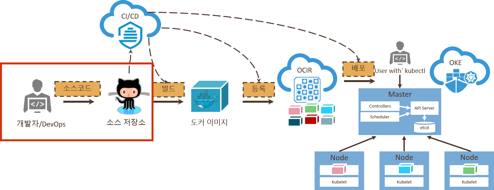
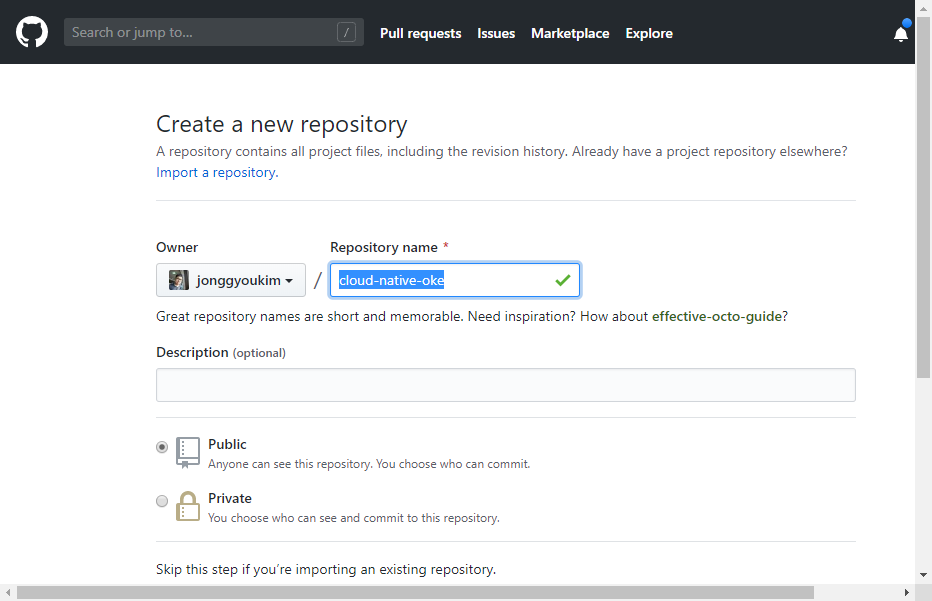
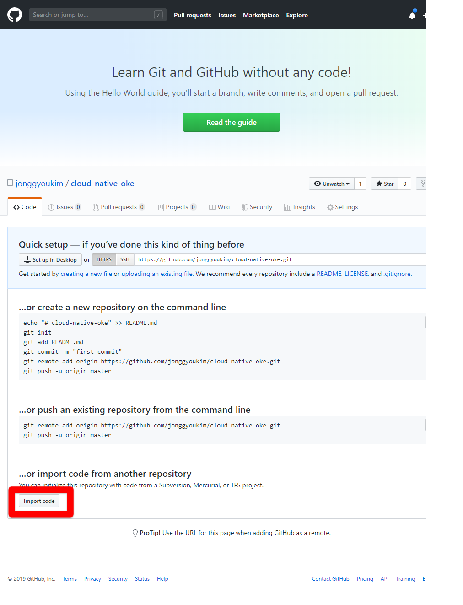
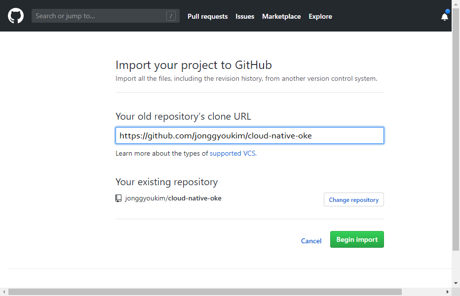
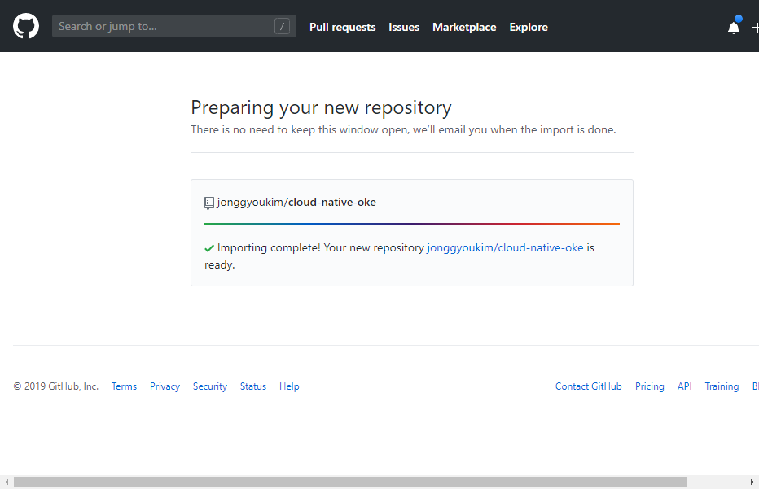

# Github Account 생성 및 로그인

1. [https://github.com](https://github.com) 에 접속하여 로그인을 합니다.

1. 계정이 없으시면 "Sign up" 을 눌러서 계정을 생성합니다.

    

# Git Repository 생성

실습할 애플리케이션을 자신의 git repository에 복사합니다.

1. http://github.com 으로 접속한 후, 좌측의 New 버튼을 클릭하여 repository를 새로 만듧니다.

    

1. Repository name 항목에 "cloud-native-oke" 라고 씁니다. 그리고 하위의 Create Repository를 클릭합니다.

    

1. Repository가 만들어지면 아래쪽의 "Import code" 버튼을 클릭하여 실습에 사용할 애플리케이션을 import 합니다.

    

1. Your old repository's clone URL 부분에 다음을 입력합니다.

    ~~~
    https://github.com/jonggyoukim/cloud-native-oke
    ~~~

    

1. 완료가 되면 repository가 준비됩니다.

    

---
완료하셨습니다.
