# Wercker 생성

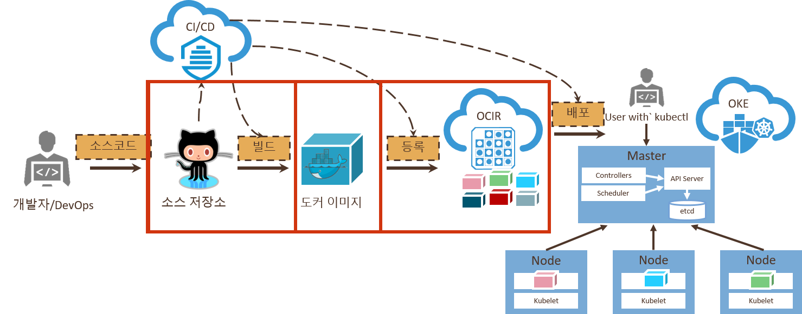

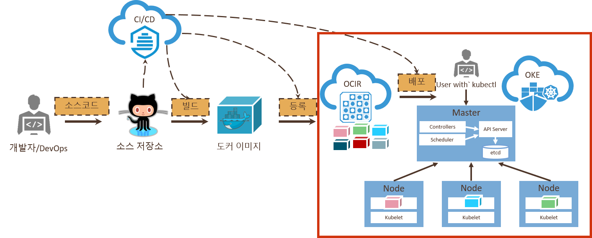

오라클 컨테이너 기반 CI(Continuous Integration) 서비스인 Wercker를 사용하여 컨테이너 이미지 빌드, 테스트와 쿠버네티스 환경에 배포를 자동화하는 시나리오입니다.

Wercker 계정에 로그인을 합니다.  
계정이 없다면 생성을 위해 app.wercker.com에 접속한 후 우측 Sign up 을 클릭합니다.

"**SIGN UP USING GITHUB**" 을 클릭하여 github을 통해서 생성합니다.    

가입이 성공하면 로그인을 합니다.

Wercker에서는 하나의 Github Repository에 대응되는 단위를 애플리케이션이라 하며, Wercker 애플리케이션은 Step, Pipeline, Workflow를 포함합니다.  
먼저 Wercker 애플리케이션을 하나 생성합니다.   

**Create your first application** 클릭합니다.

좀 전에 가입한 GitHub을 선택하고 Next를 누릅니다.  
화면에서 **cloud-native-oke** 라는 이름의 repository를 선택하고 Next를 누릅니다.

SSH key는 public으로 할 것이니 기본적으로 선택된 사항으로 Next 를 누릅니다.

전체적인 항목을 보고 "Create"를 눌러 애플리케이션을 생성합니다.

# 환경변수 설정

Wercker Application에서 **Oracle Container Registry** 에 컨테이너 이미지를 푸시하기 위한 설정을 합니다. 

상단 탭 메뉴중에서 **Environment**를 선택합니다.

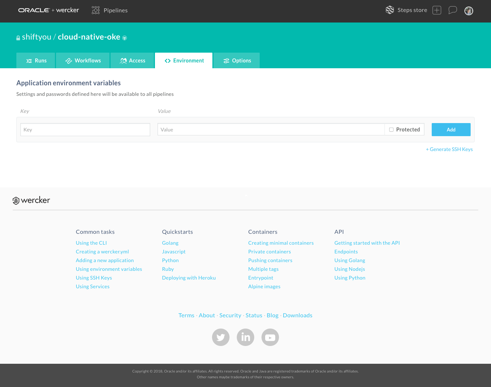

필요한 Key와 Value는 다음과 같습니다.(**📌 실제로 필요한 변수들은 여러가지이나 1시간 실습을 위하여 대부분을 고정으로 설정하였습니다.**)

- KUBERNETES_NAMESPACE
    
각 항목을 어떤값으로 설정하는지 살펴보도록 합니다.

핸즈온을 위하여 여러사람이 동일한 애플리케이션을 배포하기 때문에 중복을 피하기위하여 Kubernetes의 Namespace를 사용합니다.  
Kubernetes Cluster에 Namespace를 지정하여 Pod, Service, Deployment, Secret을 분리합니다.   
그리고 Registry의 docker image의 이름도 개별적으로 생성합니다.

- **Key:** KUBERNETES_NAMESPACE  
- **Value:**: 고유한 값 (예: jonggyoukim) - Space 없이 모두 붙여 쓰세요

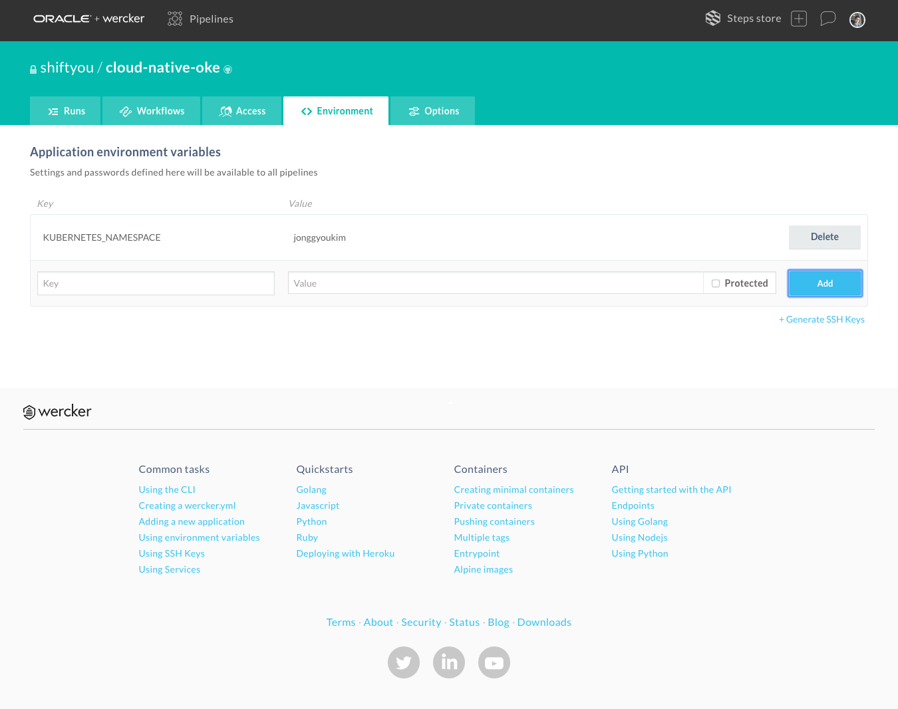

# 파이프라인 생성

CI/CD 에서 어떤 작업을 할 것인지 정의하는 것을 pipeline 이라 한다. 상위 메뉴중에 "Workflows" 항목을 클릭하여 Pipeline을 정의할 수 있다.  

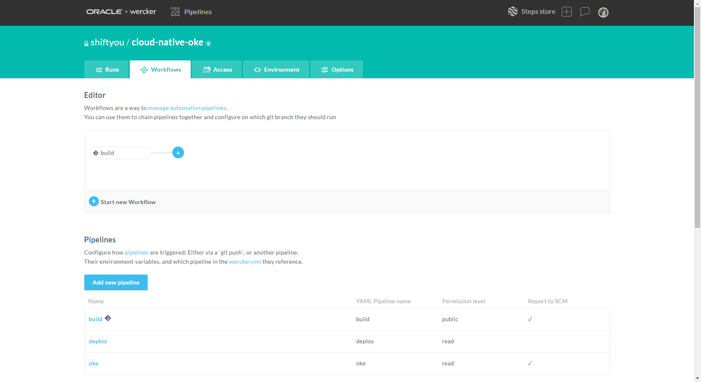

이번 샘플에서 할 pipeline 은 다음의 세가지이다.
- build : 소스를 컴파일 하는 작업
- deploy : Docker image를 만들어서 Registry에 올리는 작업
- oke : OCI의 Kubernetes 에서 서비스하는 작업

기본적으로 **build** 라는 이름의 pipeline이 정의되어 있다. 이는 Yaml 설정에서 build 라는 이름으로 맵핑된다.

그래서 deploy 와 oke 라는 pipeline을 추가해 준다.  
위 화면에서 **Add new pipeline**을 클릭한다.

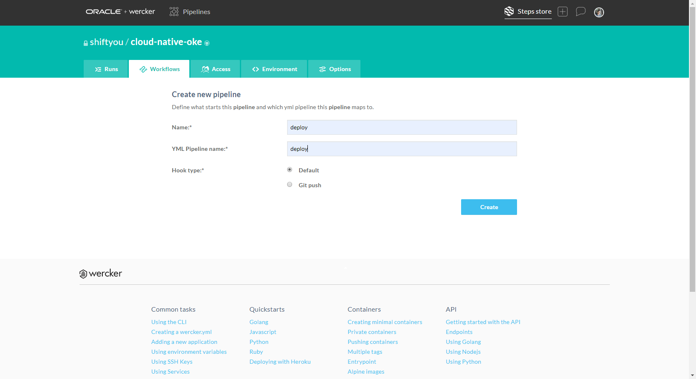

- **Name** : deploy
- **YML Pipeline name:** : deploy

"Create" 버튼을 눌러 완성한다.  

그리고 oke 도 만든다.

- **Name** : oke
- **YML Pipeline name:** : oke

다시 화면에서 다음위치의 + 를 클릭한다.

화면 아래의 "Execute pipeline" 을 클릭하여 **deploy**를 선택하고 Add를 누른다.

그 후 deloy pipeline 옆의 + 를 눌르 oke pipeline 도 만든다.

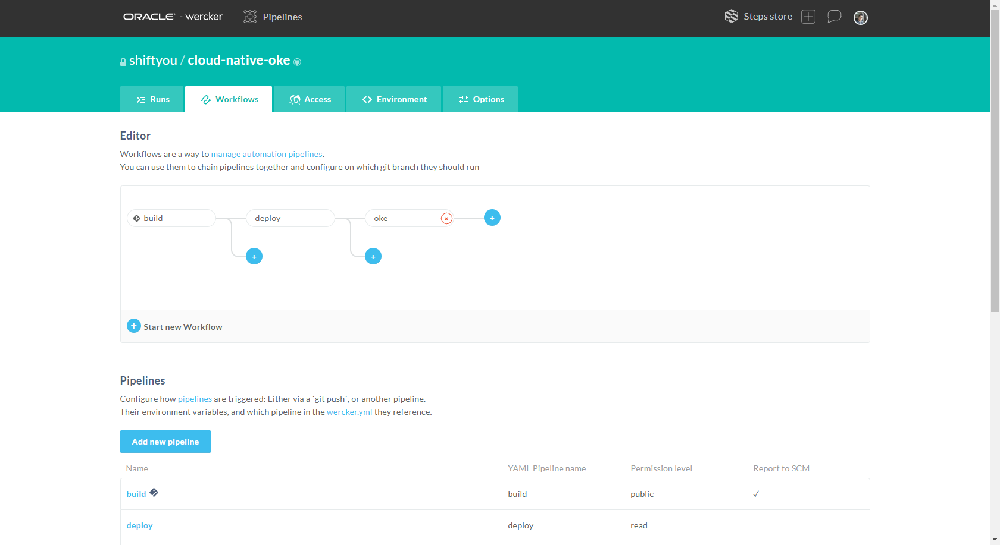

파이프라인이 완성되었다.

# WERCKER.YML

아래는 pipeline을 구성하는 wercker.yml 파일이다.
~~~yaml
box:
 id: node:latest
 ports:
   - "8080"

# Build definition
build:
  # The steps that will be executed on build
  steps:
    - script:
        code: export NODE_ENV='testing'

    # A step that executes `npm install` command
    - npm-install

    # A custom script step, name value is used in the UI
    # and the code value contains the command that get executed
    - script:
        name: echo nodejs information
        code: |
          echo "node version $(node -v) running"
          echo "npm version $(npm -v) running"

#Push the docker image with our built and tested application to the Oracle Container Registry
deploy:
  steps:
    - internal/docker-build:
        dockerfile: Dockerfile
        image-name: oke-sample

    - internal/docker-push:
        image-name: oke-sample
        username: $DOCKER_USERNAME
        password: $OCI_AUTH_TOKEN
        registry: https://$DOCKER_REGISTRY/v2/
        repository: $DOCKER_REGISTRY/$DOCKER_REPO

#Deploy our container from the Oracle Container Registry to the Oracle Container Engine (Kubernetes)
oke:
  box:
    id: alpine
    cmd: /bin/sh

  steps:
    - bash-template

    - kubectl:
        name: create namespace
        server: $KUBERNETES_MASTER
        token: $KUBERNETES_AUTH_TOKEN
        insecure-skip-tls-verify: true
        command: create namespace ${KUBERNETES_NAMESPACE}; echo done

    - kubectl:
        name: delete secret
        server: $KUBERNETES_MASTER
        token: $KUBERNETES_AUTH_TOKEN
        insecure-skip-tls-verify: true
        command: delete secret ocirsecret --namespace=${KUBERNETES_NAMESPACE}; echo done

    - kubectl:
        name: create secret
        server: $KUBERNETES_MASTER
        token: $KUBERNETES_AUTH_TOKEN
        insecure-skip-tls-verify: true
        command: create secret docker-registry ocirsecret --docker-server=$DOCKER_REGISTRY --docker-email=nobody@oracle.com --docker-username=$DOCKER_USERNAME --docker-password='$OCI_AUTH_TOKEN' --namespace=${KUBERNETES_NAMESPACE}

    - script:
        name: "view deployment yaml"
        code: cat kube-oke-sample.yml

    - kubectl:
        name: delete oke-sample of kubernetes
        server: $KUBERNETES_MASTER
        token: $KUBERNETES_AUTH_TOKEN
        insecure-skip-tls-verify: true
        command: delete -f kube-oke-sample.yml --namespace=${KUBERNETES_NAMESPACE}

    - kubectl:
        name: deploy oke-sample to kubernetes
        server: $KUBERNETES_MASTER
        token: $KUBERNETES_AUTH_TOKEN
        insecure-skip-tls-verify: true
        command: apply -f kube-oke-sample.yml --namespace=${KUBERNETES_NAMESPACE}

    - kubectl:
        name: get all
        server: $KUBERNETES_MASTER
        token: $KUBERNETES_AUTH_TOKEN
        insecure-skip-tls-verify: true
        command: get all --namespace=${KUBERNETES_NAMESPACE}
~~~

내용은 pipeline을 구성하는 항목이며 다음의  pipeline 을 정의하고 있다.
- build

    node.js 를 수행하는 과정

- deploy

    docker image 로 만들고 registry에 deploy 하는 과정

- oke

    OKE에 해당 image를 컨테이너로 서비스하는 과정  
    중복을 회피하기 위하여 namespace 사용합니다.

# Wercker를 통해 자동배포하기

1. 자신의 github/cloud-native-oke 로 이동한다.

    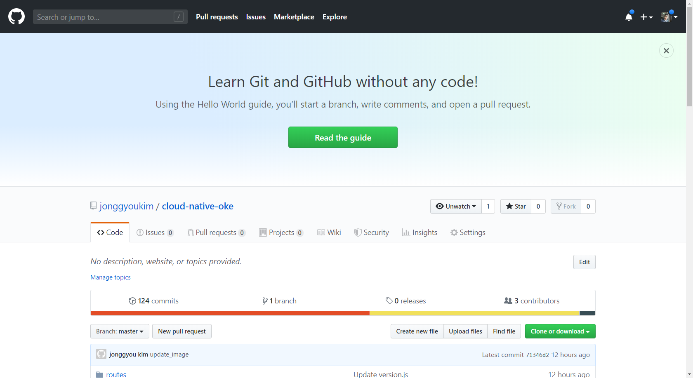

1. "routes" 디렉토리를 클릭한다.

    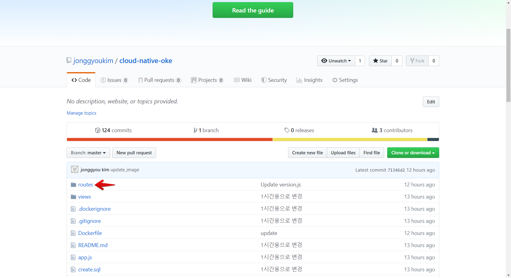

1. "version.js" 를 클릭한다.

    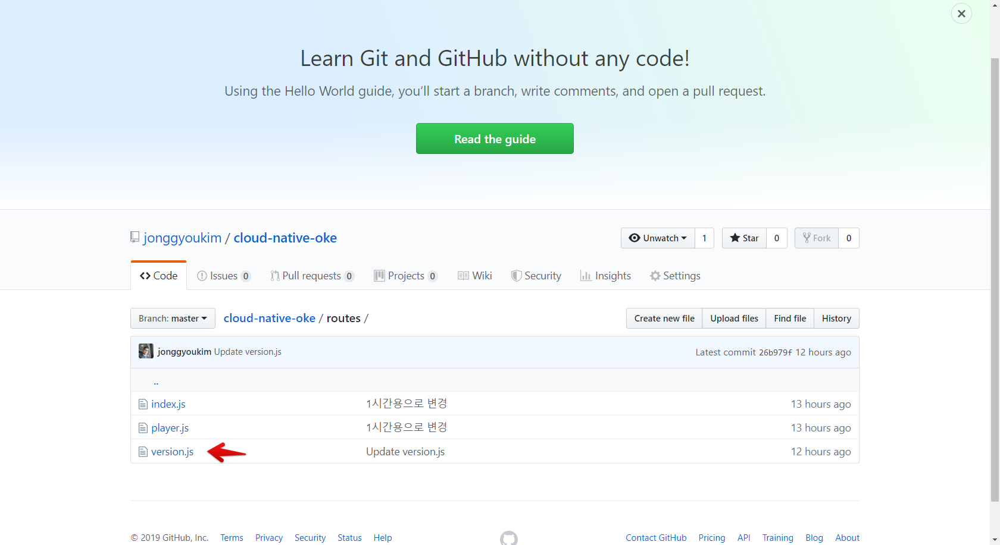

1. Edit 아이콘을 누른다.

    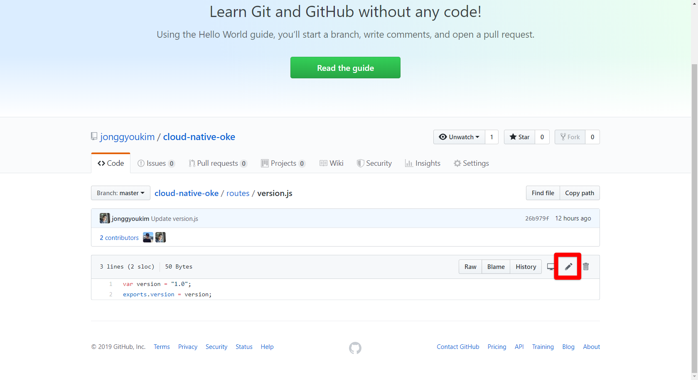

1. "1.0"을 자신의 아이디를 포함해서 업데이트 한다.

    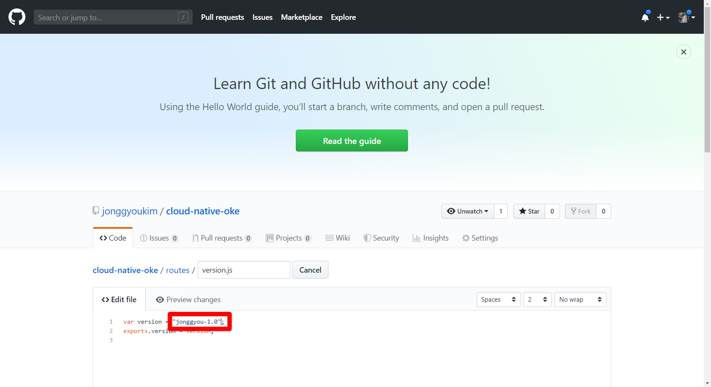

1. 아래의 "Commit changes"를 눌러 반영한다.

    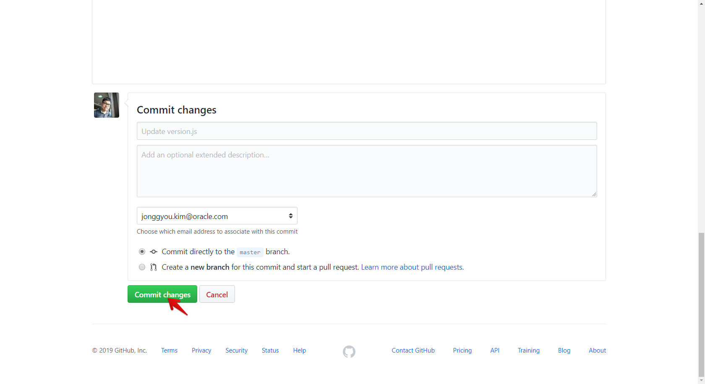

1. wercker 에서 자동으로 CI/CD가 동작되는 것을 확인한다.

    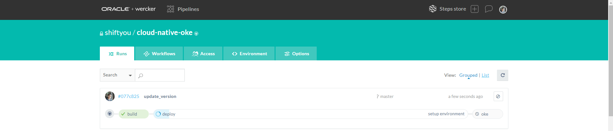

1. kubectl 로 IP가 할당됨을 확인한다.

    ~~~
    $ kubectl get all -n {네임스페이스}
    
    NAME                              READY   STATUS    RESTARTS   AGE
    pod/oke-sample-7bdd498bd7-fqrkx   1/1     Running   0          75s

    NAME                 TYPE           CLUSTER-IP     EXTERNAL-IP   PORT(S)          AGE
    service/oke-sample   LoadBalancer   10.96.246.11   <pending>     8080:30192/TCP   75s

    NAME                         DESIRED   CURRENT   UP-TO-DATE   AVAILABLE   AGE
    deployment.apps/oke-sample   1         1         1            1           75s

    NAME                                    DESIRED   CURRENT   READY   AGE
    replicaset.apps/oke-sample-7bdd498bd7   1         1         1       75s
    ~~~

    아직 **&lt;pending&gt;** 상태이면 IP가 나올 때 까지 반복한다.

    ~~~ 
    $ kubectl get all -n {네임스페이스}
    
    NAME                              READY   STATUS    RESTARTS   AGE
    pod/oke-sample-7bdd498bd7-fqrkx   1/1     Running   0          76s

    NAME                 TYPE           CLUSTER-IP     EXTERNAL-IP      PORT(S)          AGE
    service/oke-sample   LoadBalancer   10.96.246.11   150.136.200.30   8080:30192/TCP   76s

    NAME                         DESIRED   CURRENT   UP-TO-DATE   AVAILABLE   AGE
    deployment.apps/oke-sample   1         1         1            1           76s

    NAME                                    DESIRED   CURRENT   READY   AGE
    replicaset.apps/oke-sample-7bdd498bd7   1         1         1       76s
    ~~~

1. IP를 확인하고 접속해서 버젼이 바뀌어 있는지 확인한다.

---
완료하셨습니다.
