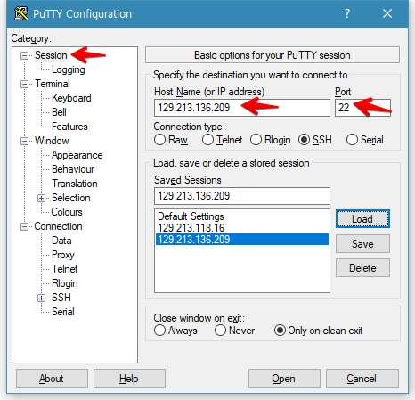
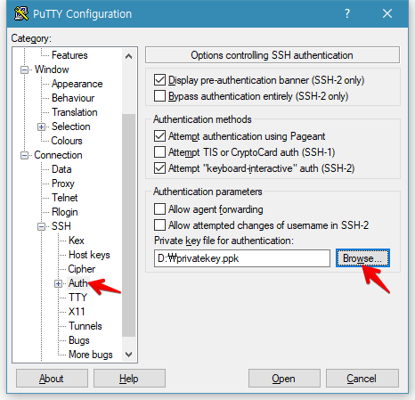
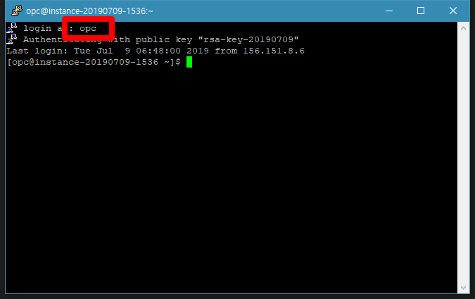

# Kubectl로 살펴보기

## 필요파일을 다운로드
- [putty](https://the.earth.li/~sgtatham/putty/latest/w64/putty.exe)
- [privatekey.ppk](files/privatekey.zip)

## Putty로 인스턴스에 접속

1. **Session** 구역에서 compute instance의 public ip와 포트를 설정합니다.

    

1. **Connection > SSH > Auth** 구역에서 ppk 파일 위치를 설정합니다.

    

1. 하단부의 **Open**을 눌러 인스턴스에 접속합니다.

    접속된 후 login as : 부분에 **opc** 를 입력하면 로그인 됩니다.

    

## 기본 namespace 바꾸기

- 전체 namespace 보기

    ~~~
    $ kubectl get namespace

    NAME            STATUS   AGE
    default         Active   173d
    ingress-nginx   Active   110d
    jonggyoukim     Active   7h50m
    kube-public     Active   173d
    kube-system     Active   173d
    ~~~

- 현재 설정보기

    ~~~
    $ kubectl config get-contexts

    CURRENT   NAME                  CLUSTER               AUTHINFO           NAMESPACE
    *         context-c2daobzgnrd   cluster-c2daobzgnrd   user-c2daobzgnrd
    ~~~
    
    ~~~
    $ kubectl get all

    NAME                 TYPE        CLUSTER-IP   EXTERNAL-IP   PORT(S)   AGE
    service/kubernetes   ClusterIP   10.96.0.1    <none>        443/TCP   7h6m
    ~~~

- 기본 namespace 바꾸기 

    ~~~
    $ kubectl config set-context --current --namespace jonggyoukim

    Context "context-c2daobzgnrd" modified.
    ~~~

- 확인

    ~~~
    $ kubectl config get-contexts

    CURRENT   NAME                  CLUSTER               AUTHINFO           NAMESPACE
    *         context-c2daobzgnrd   cluster-c2daobzgnrd   user-c2daobzgnrd   jonggyoukim
    ~~~
    
    ~~~
    $ kubectl get all

    NAME                              READY   STATUS    RESTARTS   AGE
    pod/oke-sample-7bdd498bd7-fqrkx   1/1     Running   0          13m

    NAME                 TYPE           CLUSTER-IP     EXTERNAL-IP      PORT(S)          AGE
    service/oke-sample   LoadBalancer   10.96.246.11   150.136.200.30   8080:30192/TCP   13m

    NAME                         DESIRED   CURRENT   UP-TO-DATE   AVAILABLE   AGE
    deployment.apps/oke-sample   1         1         1            1           13m

    NAME                                    DESIRED   CURRENT   READY   AGE
    replicaset.apps/oke-sample-7bdd498bd7   1         1         1       13m
    ~~~

## Kubectl

- 전체 리소스 보기

    ~~~
    $ kubectl get all

    NAME                              READY   STATUS    RESTARTS   AGE
    pod/oke-sample-7bdd498bd7-fqrkx   1/1     Running   0          13m

    NAME                 TYPE           CLUSTER-IP     EXTERNAL-IP      PORT(S)          AGE
    service/oke-sample   LoadBalancer   10.96.246.11   150.136.200.30   8080:30192/TCP   13m

    NAME                         DESIRED   CURRENT   UP-TO-DATE   AVAILABLE   AGE
    deployment.apps/oke-sample   1         1         1            1           13m

    NAME                                    DESIRED   CURRENT   READY   AGE
    replicaset.apps/oke-sample-7bdd498bd7   1         1         1       13m
    ~~~

- POD 자세히 보기

    ~~~
    $ kubectl describe pod/oke-sample-7bdd498bd7-fqrkx

    Name:               oke-sample-7bdd498bd7-fqrkx
    Namespace:          jonggyoukim
    Priority:           0
    PriorityClassName:  <none>
    Node:               10.0.11.2/10.0.11.2
    Start Time:         Wed, 06 Nov 2019 08:46:35 +0000
    Labels:             app=oke-sample
                        pod-template-hash=7bdd498bd7
                        tier=frontend
    Annotations:        <none>
    Status:             Running
    IP:                 10.244.1.28
    Controlled By:      ReplicaSet/oke-sample-7bdd498bd7
    Containers:
    oke-sample:
        Container ID:   docker://c7361fd5410fd8a4184751825dd1f751db4a32cc436f094b5d1bc9621520ecb4
        Image:          iad.ocir.io/apackrsct01/cloud-native-oke-jonggyoukim
        Image ID:       docker-pullable://iad.ocir.io/apackrsct01/cloud-native-oke-jonggyoukim@sha256:400f0fbd39394313c41ddacedc75d4914230077ddf200ee1df15e4a1067917c0
        Port:           8080/TCP
        Host Port:      0/TCP
        State:          Running
        Started:      Wed, 06 Nov 2019 08:46:38 +0000
        Ready:          True
        Restart Count:  0
        Environment:
        MYSQL_SERVICE_HOST:      129.213.149.203
        MYSQL_SERVICE_USER:      test
        MYSQL_SERVICE_PASSWORD:  Welcome1
        MYSQL_SERVICE_DATABASE:  sample
        Mounts:
        /var/run/secrets/kubernetes.io/serviceaccount from default-token-h4tbq (ro)
    Conditions:
    Type              Status
    Initialized       True
    Ready             True
    ContainersReady   True
    PodScheduled      True
    Volumes:
    default-token-h4tbq:
        Type:        Secret (a volume populated by a Secret)
        SecretName:  default-token-h4tbq
        Optional:    false
    QoS Class:       BestEffort
    Node-Selectors:  <none>
    Tolerations:     node.kubernetes.io/not-ready:NoExecute for 300s
                    node.kubernetes.io/unreachable:NoExecute for 300s
    Events:
    Type    Reason     Age   From                Message
    ----    ------     ----  ----                -------
    Normal  Scheduled  17m   default-scheduler   Successfully assigned jonggyoukim/oke-sample-7bdd498bd7-fqrkx to 10.0.11.2
    Normal  Pulling    17m   kubelet, 10.0.11.2  pulling image "iad.ocir.io/apackrsct01/cloud-native-oke-jonggyoukim"
    Normal  Pulled     17m   kubelet, 10.0.11.2  Successfully pulled image "iad.ocir.io/apackrsct01/cloud-native-oke-jonggyoukim"
    Normal  Created    17m   kubelet, 10.0.11.2  Created container
    Normal  Started    17m   kubelet, 10.0.11.2  Started container
    ~~~

- POD 늘이기

    ~~~
    $ kubectl scale deployments/oke-sample --replicas=4
    ~~~

- POD 늘이기 확인
    ~~~
    $ kubectl get all
    NAME                              READY   STATUS              RESTARTS   AGE
    pod/oke-sample-7bdd498bd7-98bkm   1/1     Running             0          7s
    pod/oke-sample-7bdd498bd7-fqrkx   1/1     Running             0          5h58m
    pod/oke-sample-7bdd498bd7-rcl4m   0/1     ContainerCreating   0          7s
    pod/oke-sample-7bdd498bd7-shz5t   0/1     ContainerCreating   0          7s

    NAME                 TYPE           CLUSTER-IP     EXTERNAL-IP      PORT(S)          AGE
    service/oke-sample   LoadBalancer   10.96.246.11   150.136.200.30   8080:30192/TCP   5h58m

    NAME                         DESIRED   CURRENT   UP-TO-DATE   AVAILABLE   AGE
    deployment.apps/oke-sample   4         4         4            2           5h58m

    NAME                                    DESIRED   CURRENT   READY   AGE
    replicaset.apps/oke-sample-7bdd498bd7   4         4         2       5h58m
    ~~~

